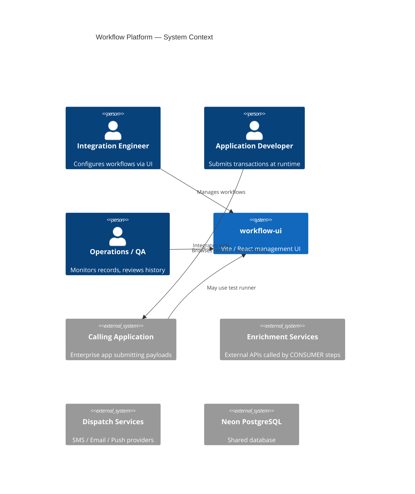
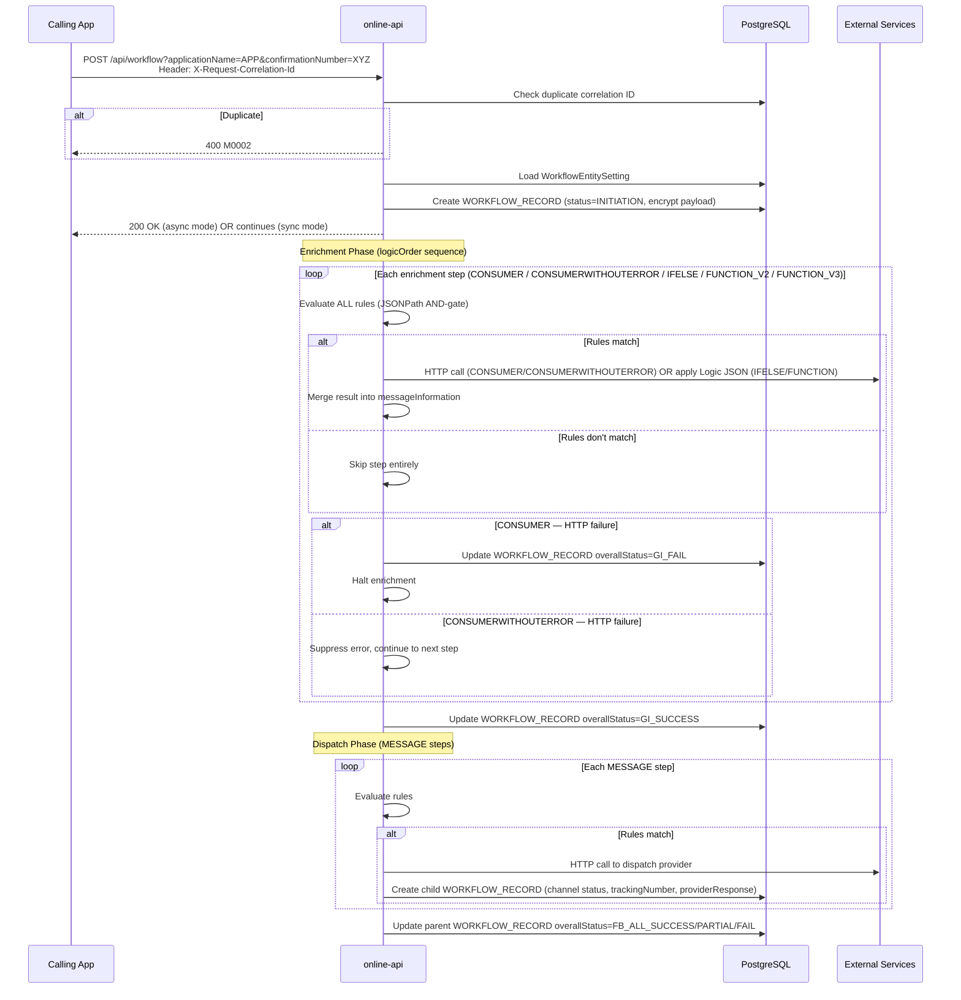
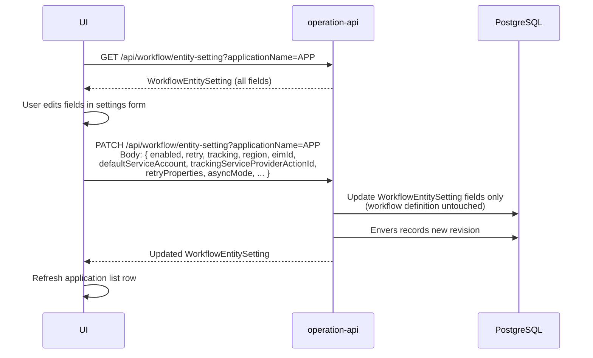
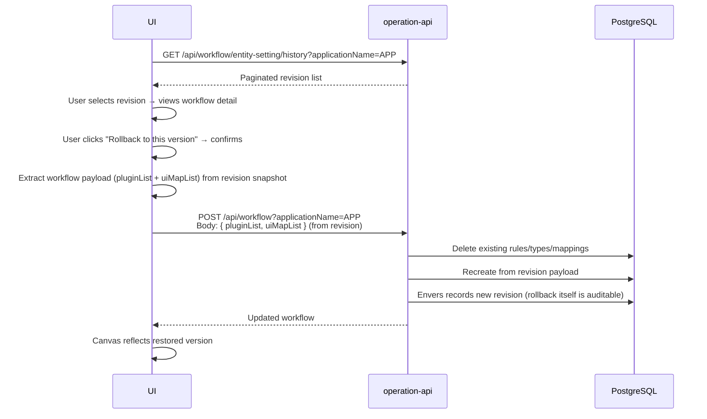
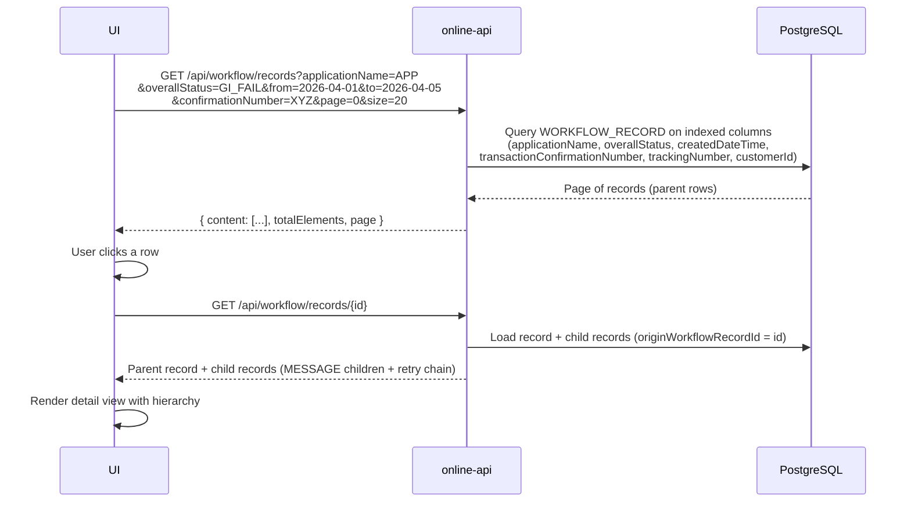
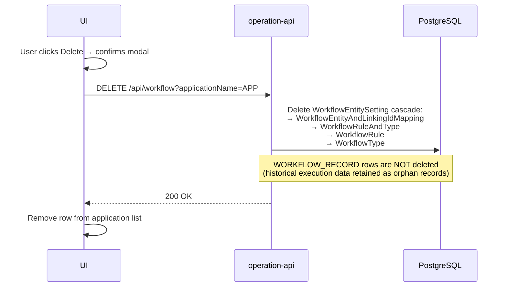

# Architect Doc — Workflow Platform
**Version**: 1.0  
**Date**: 2026-04-05  
**Status**: Draft — awaiting human approval  
**Input**: PM Doc v1.2

---

## 1. Scope

This document covers the architectural design required to deliver all user stories in PM Doc v1.2. It identifies gaps between the current codebase and the target product, defines the primary solution, specifies new/changed API contracts, and outlines the DB migration strategy.

**Features requiring architectural work (gap from current state):**

| Feature | US | Gap |
|---------|-----|-----|
| Edit entity settings from UI | US-18 | No dedicated PATCH endpoint; currently POST /api/workflow replaces everything |
| Browse execution records | US-19 | No read endpoint on online-api for WORKFLOW_RECORD |
| Delete without execution record check | US-03 | Current backend blocks delete if WORKFLOW_RECORD exists |
| CONSUMERWITHOUTERROR node type | US-13 | Type not in backend enum or executor |
| FUNCTION_V3 node type | US-13 | Type not in backend enum or executor |
| Rollback workflow to revision | US-11 | Reuses existing POST /api/workflow — no new API, but flow must be confirmed |
| Async/sync mode in entity settings UI | US-18 | Field exists in DB; not exposed in current UI |

**Features already implemented (no architectural change needed):**

- Workflow CRUD (US-04, US-05, US-06, US-07, US-08, US-09)
- Application list / create (US-01, US-02)
- Workflow copy / autoCopy (US-10)
- Configuration history (US-11 AC-11-1 to AC-11-4)
- Workflow execution pipeline, enrichment, dispatch (US-12 to US-16)
- Test runner (US-17)
- Idempotency, retry (US-15, US-16)

---

## 2. System Context



---

## 3. Component Architecture

```mermaid
C4Component
  title Workflow Platform — Components

  Container_Boundary(ui_b, "workflow-ui (Vite / React)") {
    Component(appMgmt, "Application Management", "React pages", "List, create, delete, edit settings, copy, history, rollback, execution records")
    Component(canvas, "Workflow Canvas", "XY Flow / React Flow", "Visual drag-drop editor; nodes map to backend step types")
    Component(drawer, "Step Drawer", "React forms", "Two-group config: HTTP-call (CONSUMER/MESSAGE) vs Logic (IFELSE/FUNCTION)")
    Component(testRunner, "Test Runner", "Modal + JSON editor", "Sends test payload to online-api")
    Component(apiClients, "API Clients", "operationApi / onlineApi", "Typed HTTP clients for both backends")
  }

  Container_Boundary(op_b, "workflow-operation-api (Spring Boot 4 / JDK 21)") {
    Component(wfCtrl, "WorkflowController", "REST", "GET/POST/DELETE /api/workflow; autoCopy")
    Component(esCtrl, "EntitySettingController", "REST", "GET /api/workflow/entity-setting; history; PATCH (new)")
    Component(wfSvc, "WorkflowService", "Service", "CRUD orchestration; Base64 encode/decode; duplicate-key retry")
    Component(auditRepo, "Envers Audit", "JPA/Envers", "Revision history for WorkflowEntitySetting")
    Component(opDB, "JPA Repositories", "Spring Data JPA + QueryDSL", "WorkflowEntitySetting, WorkflowRule, WorkflowType, mappings")
  }

  Container_Boundary(on_b, "workflow-online-api (Spring Boot 4 / JDK 21)") {
    Component(onCtrl, "WorkflowOnlineController", "REST", "POST /api/workflow; GET /api/workflow/records (new)")
    Component(dispSvc, "WorkflowDispatchService", "Async Service", "Two-phase pipeline: enrichment then dispatch")
    Component(execSvc, "WorkflowRuleAndTypeService", "Service", "Per-step executor: rules eval → action; handles all Type variants")
    Component(clientSvc, "CommonClientService", "Feign/HTTP", "Outbound HTTP calls for CONSUMER / MESSAGE steps")
    Component(onDB, "JPA Repositories", "Spring Data JPA", "WorkflowRecord (write); WorkflowEntitySetting (read-only)")
  }

  ContainerDb(db, "PostgreSQL (Neon)", "Shared schema owned by operation-api")

  Rel(appMgmt, apiClients, "uses")
  Rel(canvas, apiClients, "uses")
  Rel(testRunner, apiClients, "uses")
  Rel(apiClients, wfCtrl, "CRUD workflow")
  Rel(apiClients, esCtrl, "entity settings / history")
  Rel(apiClients, onCtrl, "test execution / records")
  Rel(wfCtrl, wfSvc, "delegates")
  Rel(esCtrl, auditRepo, "revision history")
  Rel(wfSvc, opDB, "reads/writes")
  Rel(onCtrl, dispSvc, "triggers async")
  Rel(dispSvc, execSvc, "per-step execution")
  Rel(execSvc, clientSvc, "HTTP-call steps")
  Rel(clientSvc, enrichSvc, "CONSUMER enrichment")
  Rel(clientSvc, dispatchSvc, "MESSAGE dispatch")
  Rel(opDB, db, "reads/writes")
  Rel(onDB, db, "reads WORKFLOW_ENTITY_SETTING; writes WORKFLOW_RECORD")
```

---

## 4. Key Sequence Diagrams

### 4.1 Workflow Execution — Two-Phase Pipeline



### 4.2 Edit Entity Settings (US-18 — new flow)



### 4.3 Rollback Workflow to Revision (US-11)



### 4.4 Browse Execution Records (US-19 — new flow)



### 4.5 Application Delete (US-03 — revised behaviour)



---

## 5. API Contract

### 5.1 New Endpoint — PATCH entity settings (operation-api)

```
PATCH /api/workflow/entity-setting?applicationName={name}
Content-Type: application/json

Request body (all fields optional — partial update):
{
  "enabled":                          boolean,
  "retry":                            boolean,
  "tracking":                         boolean,
  "region":                           string,
  "eimId":                            string,
  "defaultServiceAccount":            string,
  "trackingServiceProviderActionId":  string,
  "trackingServiceProviderActionId2": string,
  "asyncMode":                        boolean,   // true = async, false = sync
  "retryProperties": {
    "retryErrorCodes": [string],
    "maxRetryTimes":   number
  }
}

Response 200: Updated WorkflowEntitySetting
Response 404: WF-404-101 applicationName not found
Response 400: WF-400-xxx validation errors
```

> **Note**: This endpoint updates entity settings only. It does **not** touch the workflow definition (rules, types, step mappings). The existing `POST /api/workflow` continues to own the workflow definition exclusively.

### 5.2 New Endpoint — List execution records (online-api)

```
GET /api/workflow/records
Query params:
  applicationName        string   (optional, fuzzy match)
  overallStatus          string   (optional, exact match — INITIATION | GI_SUCCESS | GI_FAIL | SM_SUCCESS | SM_FAIL | FB_ALL_SUCCESS | FB_PARTIAL_SUCCESS | FB_ALL_FAIL | RETRY_ALL_FAIL)
  from                   ISO date (optional, createdDateTime >=)
  to                     ISO date (optional, createdDateTime <=)
  transactionConfirmationNumber  string (optional, exact match — primary business search key)
  trackingNumber         string   (optional, exact match)
  customerId             string   (optional, exact match)
  page                   int      (default 0)
  size                   int      (default 20, max 100)

Response 200:
{
  "content": [ WorkflowRecordRow ],
  "totalElements": number,
  "page": number,
  "size": number
}

WorkflowRecordRow fields:
  id, applicationName, transactionConfirmationNumber, requestCorrelationId,
  overallStatus, smsStatus, emailStatus, pushNotificationStatus,
  trackingNumber, customerId, retryTimes, originWorkflowRecordId,
  workflowProvider, providerDescription, createdDateTime, lastModifiedDateTime
```

```
GET /api/workflow/records/{id}
Response 200: WorkflowRecordDetail
  — same fields as WorkflowRecordRow
  — plus "children": [ WorkflowRecordRow ]  (MESSAGE child records + retry records where originWorkflowRecordId = id)
```

### 5.3 Changed Endpoint — DELETE application (operation-api)

```
DELETE /api/workflow?applicationName={name}

Current behaviour: Returns WF-409-201 if WORKFLOW_RECORD rows exist.
Target behaviour:  Always proceeds. Deletes WorkflowEntitySetting and all
                   associated workflow definition rows. WORKFLOW_RECORD rows
                   are retained as orphan historical data (applicationName
                   column preserved for reference).
```

### 5.4 Existing Endpoints — No Change

| Endpoint | Owner | Notes |
|----------|-------|-------|
| `GET /api/workflow?applicationName` | operation-api | Unchanged |
| `POST /api/workflow?applicationName` | operation-api | Used as-is for rollback (UI re-posts revision payload) |
| `GET /api/workflow/entity-setting` | operation-api | Unchanged (list + search) |
| `GET /api/workflow/entity-setting/history` | operation-api | Unchanged |
| `POST /api/workflow/autoCopy` | operation-api | Unchanged (copies entity settings + workflow definition) |
| `POST /api/workflow` (online) | online-api | Unchanged |

---

## 6. Backend Type Enum Changes

### 6.1 operation-api — WorkflowType.type

Current values persisted in `WORKFLOW_TYPE.type`:
`CONSUMER`, `IFELSE`, `FUNCTION`, `FUNCTION_V2`, `DISPATCH` (displayed as MESSAGE), `TRACKING`

Target additions:
- `CONSUMERWITHOUTERROR` — persisted as `"CONSUMERWITHOUTERROR"`
- `FUNCTION_V3` — persisted as `"FUNCTION_V3"`

Deprecated (no longer exposed in UI but retain DB read support for existing data):
- `FUNCTION` (v1) — still readable from DB; no new records created with this type

### 6.2 online-api — Type enum + executor

`Type.java` additions:
```java
CONSUMER, CONSUMERWITHOUTERROR, IFELSE, FUNCTION, FUNCTION_V2, FUNCTION_V3, DISPATCH, TRACKING
```

`WorkflowRuleAndTypeService` additions:
- **CONSUMERWITHOUTERROR handler**: same HTTP call as CONSUMER; wrap execution in try/catch and swallow exception, logging the suppressed error
- **FUNCTION_V3 handler**: implement alongside FUNCTION_V2; parameter handling details to be defined by Delivery Manager + engineer in implementation phase

---

## 7. Database Migration Strategy

All migrations owned by `workflow-operation-api` (Flyway/Liquibase or current convention). `workflow-online-api` schema is read-only (`ddl-auto=none`).

### 7.1 Required migrations

| # | Change | Table | Type |
|---|--------|-------|------|
| M-01 | Add `async_mode` boolean column (default `true`) | `WORKFLOW_ENTITY_SETTING` | Additive — safe |
| M-02 | Ensure `WORKFLOW_TYPE.type` column accepts `CONSUMERWITHOUTERROR` and `FUNCTION_V3` values (varchar — no enum constraint at DB level, already flexible) | `WORKFLOW_TYPE` | Verify only — likely no change needed |
| M-03 | Remove DB-level foreign key constraint or application-level check that prevents `DELETE` when `WORKFLOW_RECORD` rows exist | `WORKFLOW_ENTITY_SETTING` | Constraint removal — verify current schema |
| M-04 | Add index on `WORKFLOW_RECORD.origin_workflow_record_id` if not present (needed for child record lookup in US-19) | `WORKFLOW_RECORD` | Additive — safe |

### 7.2 No destructive migrations

- No columns dropped
- No existing data modified
- `FUNCTION` (v1) type rows remain readable
- `TRACKING` enum value retained in code (dead code, harmless)

---

## 8. Architectural Decisions Required from You

Before this document is considered final baseline, please decide:

| # | Decision | Options | Impact |
|---|----------|---------|--------|
| AD-1 | **WORKFLOW_RECORD orphan on delete**: when an application is deleted, should historical execution records be retained (orphan) or cascade-deleted? | A) Retain (orphan) — safer, preserves audit trail · B) Cascade delete — cleaner, loses history | Drives M-03 migration and DELETE endpoint contract |
| AD-2 | **Execution records API ownership**: should `GET /api/workflow/records` live on online-api (owns the table) or operation-api (single management plane)? | A) online-api — keeps table ownership clean · B) operation-api — single base URL for UI management features | Drives which service the UI calls for US-19 |
| AD-3 | **FUNCTION_V3 invocation model**: is FUNCTION_V3 a superset of FUNCTION_V2 (same reflection model, more parameter types) or a different invocation style (e.g. script engine, external call)? | A) Reflection superset · B) Different model | Determines implementation complexity; needed before backend engineer starts |
| AD-4 | **async_mode field name**: should the entity setting field be named `asyncMode` (boolean) or a more explicit enum (`ASYNC` / `SYNC`)? | A) boolean `asyncMode` · B) enum `executionMode` | Minor — affects API contract and DB column |

---

## 9. Plan B — Exploratory Options (for your consideration)

These are non-standard approaches worth evaluating. None are recommended as primary solution.

### Plan B-1 — Unified API gateway (single base URL for UI)
Route all UI traffic through one gateway that proxies to operation-api and online-api. Eliminates `VITE_OPERATION_API_BASE` / `VITE_ONLINE_API_BASE` split.  
**Risk**: Adds a new infrastructure component; complicates local dev.  
**Rollback**: Remove gateway, revert UI to dual base URLs.  
**Affects current release**: No — additive.

### Plan B-2 — Move WORKFLOW_RECORD reads to operation-api
Instead of adding a new read endpoint to online-api (AD-2 option B), expose `WORKFLOW_RECORD` reads via operation-api using a cross-schema read or shared JPA entity.  
**Risk**: Breaks the clean separation of management plane vs execution plane; online-api owns the table.  
**Rollback**: Trivially — keep endpoint on online-api.  
**Recommendation**: Not recommended. Option A (online-api) in AD-2 is cleaner.

---

*End of Architect Doc v1.0 — awaiting your decisions on AD-1 through AD-4 and overall approval before handoff to Delivery Manager.*
